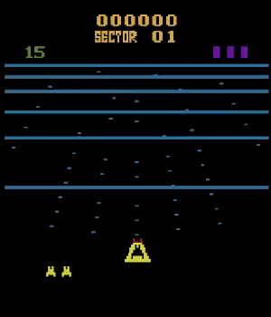

# Atari BeamRider AI - Reinforcement Learning - DQN

Implemented a [DQN](https://arxiv.org/pdf/1312.5602v1.pdf) agent for playing Atari BeamRider game.

# Features

- Training an agent from scratch using [PyTorch](https://pytorch.org/).
- Checkpoints: after each epoch of training, save model weigths and replay memory, so the training can be stopped and resumed later.
- Memory friendly: since the replay memory has a large size (1M x 4 images), it doesn't fit in a regular laptop RAM. Solution: store it on disk using [Pytables HDF5](https://www.pytables.org/).
- Can be easily adapted to other Atari games using [gym-retro](https://retro.readthedocs.io/en/latest/).

# Installation

Tested on Ubuntu 22.04.
- Install [Anaconda](https://www.anaconda.com/download/)
- Reopen the terminal
- Run commands from [install.txt](install.txt)
- Download Atari ROMs from [here](https://www.atarimania.com/rom_collection_archive_atari_2600_roms.html)
- Extract the archive
- Run the command `python3 -m retro.import /path/to/Atari2600Games/ROMS` (replace `/path/to` with the actual path)

# Running

- Start training `python train_dqn.py`
  - If getting the error `pyglet.gl.ContextException: Could not create GL context` then run again with `LD_PRELOAD=/usr/lib/x86_64-linux-gnu/libstdc++.so.6 python train_dqn.py` (see [here](https://stackoverflow.com/questions/71010343/cannot-load-swrast-and-iris-drivers-in-fedora-35/72200748#72200748))
  - To see the agent playing, uncomment the line `# env.render()`
- To try with another game, change line `env = retro.make(game="BeamRider-Atari2600")` with the desired game (`retro.data.list_games()` shows the available games)
  - To try out the actions, run the `player.py` script
  - To see the rewards, uncomment `print(rew)` in `train_dqn.py` -> then modify `RewardWrapper` in [environment.py](src/environment.py)
- To evaluate the agent, use `eval_dqn.py` - will take the checkpoints available for each epoch and produce a CSV file with their performance
